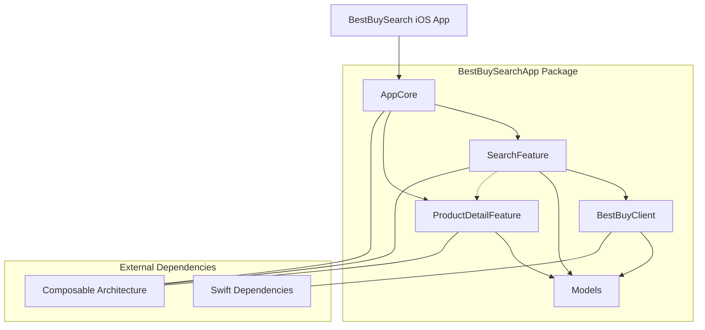

# BestBuySearch-SwiftUI

> [!NOTE]
> This is a **demo project** intended to showcase a modern iOS architecture using The Composable Architecture (TCA). It does not provide any practical usage or a complete e-commerce experience.

A modern iOS application for searching Best Buy products using the Best Buy Products API, refactored with **The Composable Architecture (TCA)** and a modular **Swift Package Manager (SPM)** design.

## Features

- **Product Search**: Efficient search with debounced input and real-time results.
- **Infinite Scrolling**: Automatically loads the next page as you reach the end of the list.
- **Product Details**: View high-resolution images, pricing, and descriptions for each product.
- **UPC-12 Validation**: Integrated check-digit validation for product UPCs.
- **Modular Architecture**: Clean separation of concerns with independent modules for core logic, features, and networking.

## Architecture & Tech Stack

- **[The Composable Architecture (TCA)](https://github.com/pointfreeco/swift-composable-architecture)**: Manages state, actions, and side effects in a predictable and testable way.
- **SwiftUI**: Modern declarative UI framework.
- **Swift Package Manager (SPM)**: Used for modularizing the app into independent, reusable features.
- **[Swift Dependencies](https://github.com/pointfreeco/swift-dependencies)**: For managing external dependencies like the Best Buy API client.
- **Combine**: Used internally for debouncing and reactive streams.

## Project Structure

### Architecture Diagram

The core application logic resides in the `BestBuySearchApp` SPM package, divided into the following modules:

- **AppCore**: The root module that composes all feature reducers and handles navigation.
- **SearchFeature**: Contains the logic and view for product search and the result list.
- **ProductDetailFeature**: Handles the detailed view of a single product and includes the `CheckValidator`.
- **BestBuyClient**: A dependency client for interacting with the Best Buy Products API.
- **Models**: Pure Swift value types for `Product` and `SearchResult`, shared across modules.

## Getting Started

### Prerequisites

- **Xcode 15.0+**
- **iOS 16.0+** (The project uses `WithPerceptionTracking` for iOS 16 compatibility)

### Installation

1. Clone the repository.
2. Open `BestBuySearch/BestBuySearch/BestBuySearch.xcodeproj`.
3. Wait for Swift Package dependencies to resolve.
4. Run the app on a simulator or a physical device.

## Testing

The project includes a comprehensive suite of unit tests, including TCA-specific `TestStore` tests for feature logic and standard `XCTest` for utility logic.

To run the tests:
- In Xcode: **Cmd + U**
- Via Command Line: `swift test --package-path BestBuySearch/BestBuySearchApp`

## Screenshots

  
  
  

